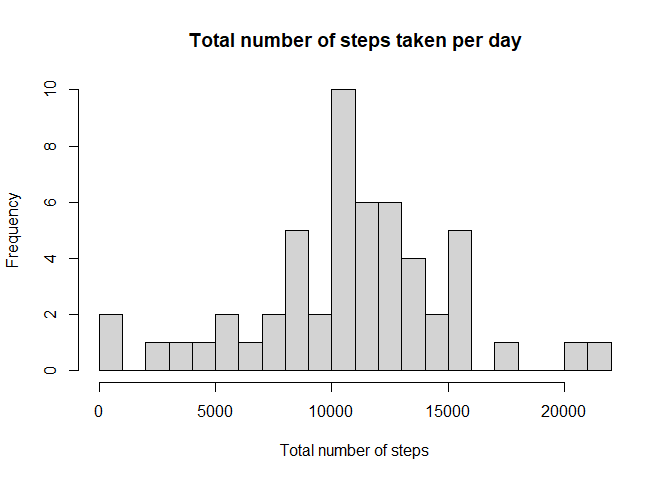
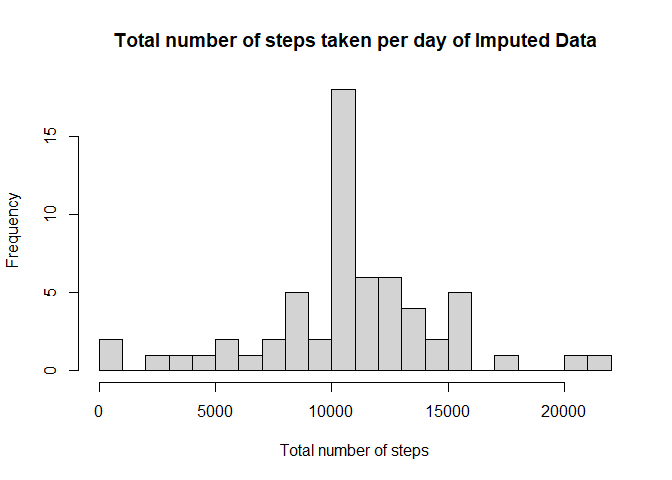
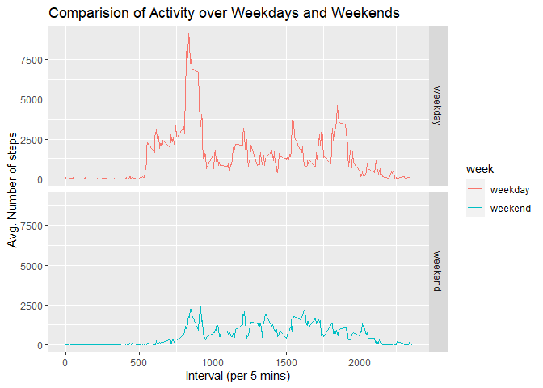

## Loading and preprocessing the data

Obtained the data from Coursera. Loaded it into the workspace using read.csv
and converted the date column into a Date format using the lubridate package.


```r
library(dplyr)
library(lubridate)
library(ggplot2)

data = read.csv("activity.csv")

d = ymd(data$date)
data$date = d
```

## What is mean total number of steps taken per day?

When  completing this task, missing values were removed using filter in dplyr.
The data was then grouped in terms of date and summarized to calculate the 
sum of each group to get the total number of steps per day.  


```r
df = filter(data, data$steps != "NA")

total_steps = df %>% group_by(date) %>% summarise( sum_steps = sum(steps))

mean_steps = mean(total_steps$sum_steps)

median_steps = median(total_steps$sum_steps)
```


```r
hist(total_steps$sum_steps, breaks = 20, xlab = "Total number of steps", main = "Total number of steps taken per day")
```

<!-- -->

The mean of the total number of steps per day is 1.0766189\times 10^{4} and 
the median is 10765. It is worth noting that the mean and median are
very similar. It can be clearly seen from the graph the
highest frequency lies between 10,000 and 11,000 steps.


## What is the average daily activity pattern?

The missing values are still removed from the data.
The data was grouped in terms of the intervals and the average was calculated 
using a similar method in the first question.


```r
avg_act = df %>% group_by(interval) %>% summarise( avg_steps = mean(steps))

## max interval (which.max gives location in list of the max interval)
avg_act[which.max(avg_act$avg_steps),]
```

```
## # A tibble: 1 x 2
##   interval avg_steps
##      <int>     <dbl>
## 1      835      206.
```

```r
with(data = avg_act, plot(interval, avg_steps, type = "l"))
```

<!-- -->
  
The interval with the max. number of steps is 835 with 206 steps, which can be
confirmed by looking at the figure.


## Imputing missing values

There is missing values "NA" present in the dataset. In this task we are asked 
to come up with an imputing method.  

Firstly we need to determine the number of missing values.  


```r
# table (True is the number of NAs)
table(is.na(data$steps))
```

```
## 
## FALSE  TRUE 
## 15264  2304
```
  
The total number of missing values are 2304.  

The method used to impute the missing values is simple. The mean number of 
steps were calculated in terms of the 5 minute intervals. The mean of the 
results was substituted into the dataset where there were missing values.  
Then a similar method that was used in the first question was used to calculate 
the total number of steps and thereafter the mean and median.


```r
## Finding the mean of each day to impute into the missing values
mean_interval = df %>% group_by(interval) %>% summarise( m = mean(steps))

## took the mean of the means of the intervals to impute into the missing values

imp = data$steps
imp[is.na(imp)] = mean(mean_interval$m)

imp_data = data
imp_data$steps = imp

imp_total_steps = imp_data %>% group_by(date) %>% summarise( imp_sum_steps = sum(steps))

imp_mean_steps = mean(imp_total_steps$imp_sum_steps)

imp_median_steps = median(imp_total_steps$imp_sum_steps)
```

```r
hist(imp_total_steps$imp_sum_steps, breaks = 20, xlab = "Total number of steps", main = "Total number of steps taken per day of Imputed Data")
```

<!-- -->
  
There is an increase in frequency at the 10,000 - 11,000 interval. 
But there has been no change in the mean and median, the median (1.0766189\times 10^{4}) 
and mean (1.0766189\times 10^{4}), for the imputed data set are the same. 


## Are there differences in activity patterns between weekdays and weekends?

The dataset has been separated into 2 groups, the week and weekend.
Using a similar method as the previous question, it will be determined if there
is a difference in activity between weekdays and weekends.


```r
week_df = df

week_df$days = weekdays(week_df$date)

weekend = c("Saturday","Sunday")

week_df$week = ifelse(week_df$days %in% weekend,"weekend","weekday")

week_steps = week_df %>% group_by(interval,week) %>% summarise( w_mean_steps = sum(steps))
```

```r
ggplot(data = week_steps, aes(interval,w_mean_steps, colour = week)) + geom_line() + 
  facet_grid(week~.) + labs(x = "Interval (per 5 mins)", y = "Avg. Number of steps", title = "Comparision of Activity over Weekdays and Weekends")
```

<!-- -->
  
It can be clearly seen from the figure above, that there is higher activity
during the weekdays than the weekends. Especially between the intervals of
500-1000


